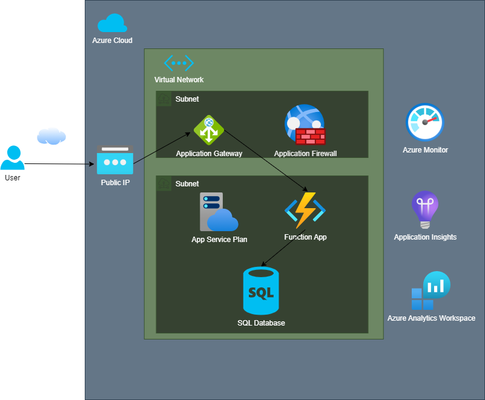

# Terraform_Project

## Introduction

In this project we deploy infrastructure using code, the diagram above represents our deployment. Furthermore, we also deploy an application that consists of a simple function pushing and pulling data from a database. 

## PART 1 - Azure Subscription Setup

1- First open terminal and login

az login

2- Then set the subscription you wish to use

az account set --subscription = "sunscription id"

3- For your subscription create a service principle with a contributor role 

az ad sp create-for-rbac --role="Contributor" --scopes="/subscriptions/sunscription id"

Please save the output of this command, it will be required later.

## PART 2 - Azure DevOps Setup for Infustructure as Code

1 - Create a new organisation

2 - for your new organisation. create a new project i.e "terraform_project"

3 - On the left panel click Repos icon and clone the following repo : 

https://github.com/DrisDary/terraform_project_IaC.git

4  - On the left panel click on Pipeline and create a New pipeline.

Connect your code to the Azure Repo Git that you cloned in step 3.

Set tf_init_plan.yaml file path in the repo. Finally, save it.

5 - Go to your pipelines and select the pipeline you just created. Click on Edit, on the far right click on the '3-dot' icon and select Triggers.

If your YAML file path is not set or was not set in step 4 then you can set it under the YAML tab.

Under the variables tab, set the following variable names and their values.

Please note that the the names must be spelt exactly as below, this is terraforms standard for Azure.

Name:                   Value:

ARM_CLIENT_ID           XXXXXXXX-XXXX-XXXX-XXXX-XXXXXXXXXXXX

ARM_CLIENT_SECRET       XXXXXXXXXXXXXXXXXXXXXXXXXXXXXXXXXXXX

ARM_SUBSCRIPTION_ID     XXXXXXXX-XXXX-XXXX-XXXX-XXXXXXXXXXXX

ARM_TENANT_ID           XXXXXXXX-XXXX-XXXX-XXXX-XXXXXXXXXXXX

WorkingDirectory        tf_devops_project_001

6 - Repeat step for but for the tf_apply.yaml file.

7 - Your pipelines should be set and so to test this by selecting and running on your pipelines.

## PART 3 - Azure DevOps Setup for application code

1 - Under the organisation you created in PART 2, create a new project i.e App Code

2 - Select the settings icon on the bottom left and create a service connection.

3 - Complete the subscription detail using information from STEP 1.

4 - On the left panel click Repos icon and clone the following repo : 

https://github.com/DrisDary/terraform_project_app.git

5  - On the left panel click on Pipeline and create a New pipeline.

Connect your code to the Azure Repo Git that you cloned in step 3.

Set fn_app_ci.yaml file path in the repo. Finally, save it.

6 - On the left panel click on Pipeline and select releases.

Select new release pipeline.

Under the tasks tab add a 'Azure Function App Deploy' and complete the details so that it matches the fn_app_cd.yaml file. Save it.

7 - Now your completed and can test both your ci pipelines and and cd piplines by running selecting and running piplines under the 'Pipeline' and 'Releases' tab on the left.